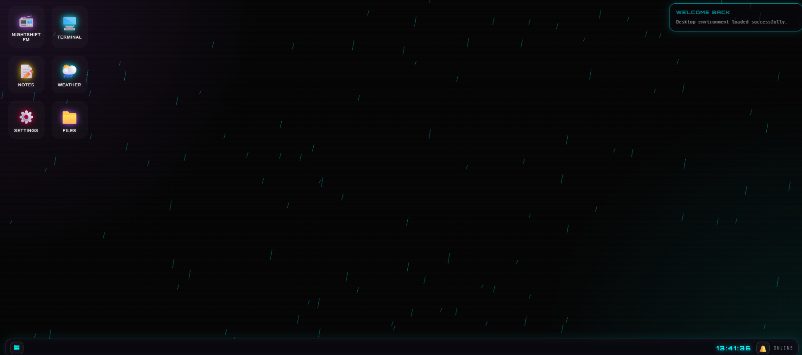

# NIGHTCITY // OPERATING SYSTEM

NIGHTCITY OS is a browser-based cyberpunk desktop operating system built with plain HTML, CSS, and vanilla JavaScript.

It includes a boot screen, draggable windows, desktop icons, taskbar, live clock, fake file explorer, terminal, notes app, weather app, radio app, notifications, animated canvas wallpaper, themes, and saved settings.

## Live Demo

Coming soon after GitHub Pages deployment.

## Screenshot

```md
